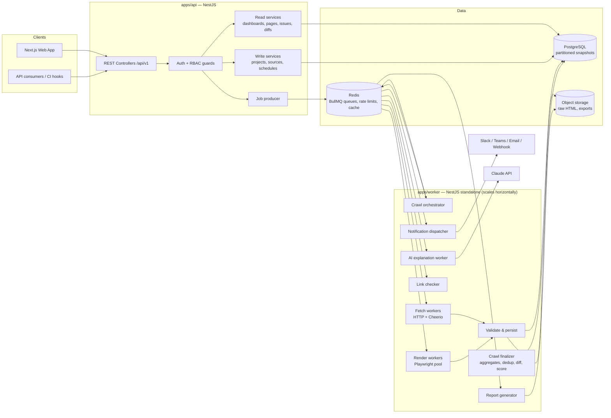
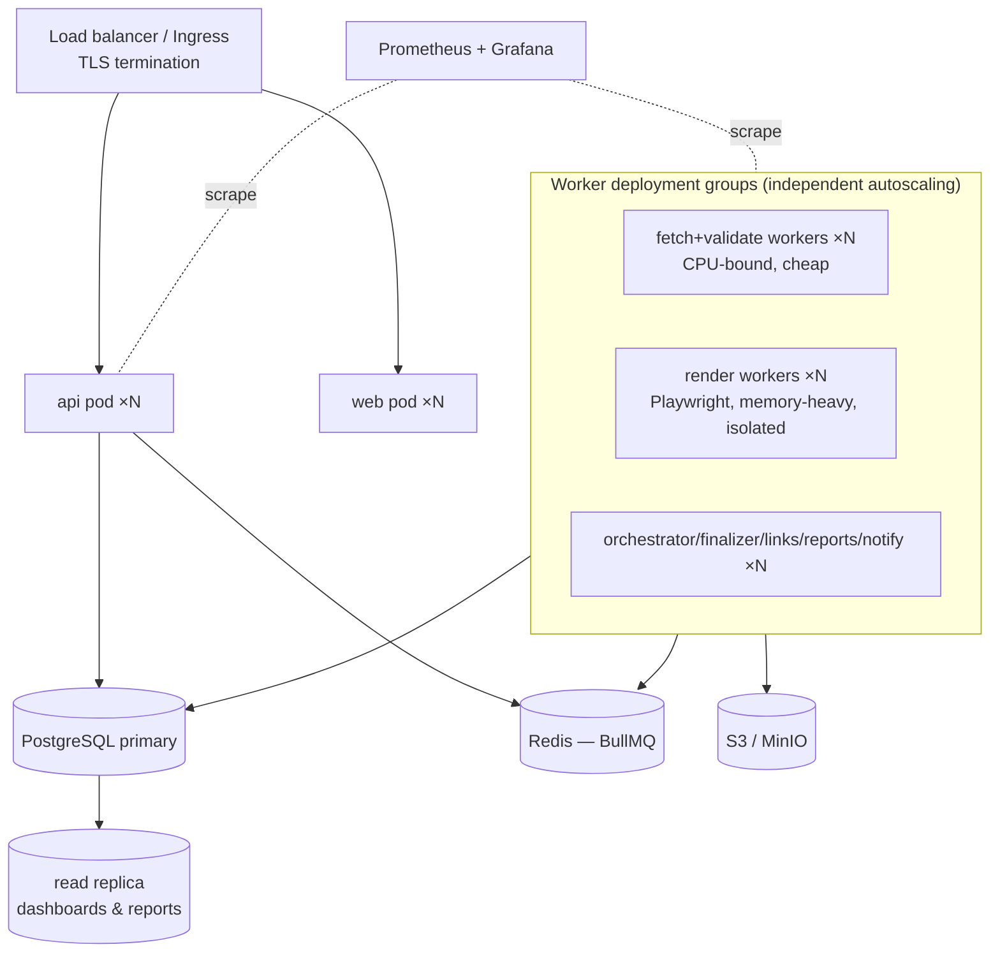

# 02 — System Architecture

## 1. High-level design

The system is three deployable applications sharing pure domain packages, connected by PostgreSQL (system of record), Redis/BullMQ (job transport), and S3-compatible object storage (raw HTML bodies).

### Component responsibilities

| Component                | Responsibility                                                                                                                | Explicitly not responsible for           |
| ------------------------ | ----------------------------------------------------------------------------------------------------------------------------- | ---------------------------------------- |
| `apps/web`               | Dashboard UI, all screens in [07-frontend.md](07-frontend.md)                                                                 | Business logic; it renders API responses |
| `apps/api`               | AuthN/Z, CRUD, read models, enqueueing jobs, SSE progress streams                                                             | Fetching or validating anything          |
| `apps/worker`            | All heavy work: orchestrating crawls, fetching, rendering, validating, diffing, aggregating, reports, notifications, AI calls | Serving user traffic                     |
| `packages/seo-engine`    | Pure Technical-SEO check library (input: parsed page artifacts → output: issues)                                              | I/O of any kind                          |
| `packages/schema-engine` | Structured-data extraction + schema.org/rich-result validation                                                                | I/O of any kind                          |
| `packages/crawler-core`  | Fetch/render/robots/sitemap primitives with SSRF guards                                                                       | Business rules                           |
| `packages/shared`        | DTOs, zod schemas, enums, error codes shared API↔web↔workers                                                                  | Logic                                    |

Dependency direction (enforced by lint rule): `apps/* → packages/*`; packages never import from apps; `seo-engine`/`schema-engine` import nothing but `shared`.

## 2. Data flow — one scheduled crawl

1. **Scheduler** (BullMQ repeatable job per schedule row) fires → enqueues `crawl.orchestrate`.
2. **Orchestrator** creates the `crawls` row (status `resolving`), resolves the URL set from all active sources (sitemaps re-fetched and diffed against the previous crawl's set, CSV/manual lists, discovery seeds), records per-URL discovery metadata, then enqueues one `page.process` job per URL (status `running`). Discovery-mode crawls also enqueue newly found internal links back onto the same crawl until depth/count limits.
3. **Fetch worker** takes `page.process`: consults per-domain rate-limit token bucket (Redis), issues conditional GET. On 304/content-hash match in incremental mode → mark unchanged, optionally carry forward previous results. If the website's render policy requires JS (or auto-detection triggers), re-enqueue to the `render` queue where a **Playwright pool** produces the final DOM.
4. **Validate & persist**: parse with Cheerio → build the `PageArtifacts` value object → run `seo-engine` + `schema-engine` → write `page_snapshots`, `page_issues`, `schema_entities` rows in one transaction; raw HTML → object storage keyed by content hash. Discovered links are recorded for the link checker and orphan analysis.
5. **Link checker** verifies unique outbound targets (HEAD/GET with caching per crawl) and writes broken-link issues.
6. **Finalizer** runs when all page jobs settle: cross-page checks that need the whole crawl (duplicate detection via hash groups, orphan pages, sitemap-vs-crawl reconciliation), diff vs previous crawl (`crawl_changes`), score computation, `crawl_aggregates` + trend rollups, then fires notification rules and scheduled reports.
7. **Dashboard** reads only precomputed aggregates and indexed snapshot tables; live progress is served from crawl counters (Redis, flushed to PG) over SSE.

## 3. Key design decisions

| #   | Decision                                                                               | Rationale                                                                                                                                   | Alternative rejected                                                                  |
| --- | -------------------------------------------------------------------------------------- | ------------------------------------------------------------------------------------------------------------------------------------------- | ------------------------------------------------------------------------------------- |
| D1  | **Monorepo (pnpm + Turborepo)** with three apps + pure packages                        | Shared types end-to-end; engine reusable by API/workers/CLI; atomic cross-cutting changes                                                   | Polyrepo — version-skew pain for internal tool                                        |
| D2  | **PostgreSQL as system of record with monthly-partitioned snapshot tables**            | Relational queries dominate (filters, joins, diffs); partition pruning keeps 100M+ row tables fast; mature ops                              | Document store for snapshots — loses cheap cross-page SQL (duplicates, diffs, trends) |
| D3  | **Raw HTML in object storage, not PG**                                                 | Bodies are ~100KB×millions = TB-scale; PG stores extracted artifacts (~5KB JSONB) + hash pointer                                            | HTML in PG — bloats backups, ruins vacuum                                             |
| D4  | **HTTP-first fetching, Playwright as policy-driven fallback**                          | 10–50× cheaper than rendering; most enterprise pages are SSR; auto-detect flags client-rendered sites once per site, not per page           | Render everything — 8h crawl becomes days                                             |
| D5  | **BullMQ with per-queue worker pools + per-domain limiter groups**                     | Fetch, render, links, reports scale independently; politeness enforced at queue layer; pause/resume/cancel are queue primitives             | One fat queue — renders starve fetches, no isolation                                  |
| D6  | **Validation as pure functions over `PageArtifacts`**                                  | Deterministic, fixture-testable, replayable (re-validate old crawls after rule changes without refetching)                                  | Checks doing their own I/O — untestable, unscalable                                   |
| D7  | **Vocabulary & rich-result profiles as versioned JSON rule packs**                     | Schema.org and Google requirements change; data updates, not code changes; snapshots record which pack version judged them                  | Hardcoded per-type validators                                                         |
| D8  | **Immutable snapshots + derived diff/aggregate tables**                                | History/trends/regressions become simple reads; recomputable if diff logic improves                                                         | Mutating page rows — destroys the product's core promise                              |
| D9  | **Incremental via conditional GET + content hash, results carried forward explicitly** | A daily crawl of 1M pages where 2% changed does ~2% of the work; carry-forward rows are marked so UIs can distinguish measured vs inherited | Always full crawl — cost prohibits daily cadence                                      |
| D10 | **AI as read-only explanation layer with caching**                                     | Trust: numbers are deterministic; LLM output cached by evidence hash, labeled, rate-limited                                                 | AI-in-the-loop scoring — non-reproducible audits                                      |
| D11 | **SSE (not WebSockets) for live crawl progress**                                       | Unidirectional updates; works through proxies; trivial with NestJS                                                                          | WebSockets — extra infra for no bidirectional need                                    |

## 4. Deployment architecture

- **Dev:** single `docker-compose.yml` (postgres, redis, minio, mailhog) + `pnpm dev`.
- **Prod:** Kubernetes (or systemd on VMs — nothing k8s-specific). Render workers are a separate deployment with strict memory limits and `maxOldSpaceSize` headroom for Chromium; they crash-restart safely because jobs are at-least-once.
- **Migrations:** run as a pre-deploy job; workers and API tolerate N-1 schema (additive-first migration policy).
- **Config/secrets:** 12-factor env vars; secret manager in prod; no secrets in the repo.

## 5. Scaling strategy

| Axis                   | Mechanism                                                                                                                                 |
| ---------------------- | ----------------------------------------------------------------------------------------------------------------------------------------- |
| More pages per crawl   | Add fetch-worker replicas; BullMQ distributes; per-domain limiter keeps politeness constant regardless of worker count                    |
| More websites/projects | Queues are shared but jobs carry domain-group keys; one slow site cannot occupy more than its concurrency slice (NFR-REL-2)               |
| DB write throughput    | Batch inserts (COPY-style multi-row) per page transaction; monthly partitions keep indexes shallow; autovacuum tuned per partition        |
| DB read load           | Dashboards read `crawl_aggregates`/`trend_daily` rollups (thousands of rows, not millions); heavy explorer queries go to the read replica |
| Storage growth         | Retention tiers (NFR-RET-1): raw HTML 30d, snapshots 13m, aggregates forever; partition drop = instant cheap deletion                     |
| Render capacity        | Separate queue + pool; browser contexts recycled every K pages; per-site render budget                                                    |
| Burst control          | Queue priority: manual crawls > scheduled; report/AI queues low priority                                                                  |

## 6. Observability

- **Logs:** structured JSON (pino), correlation ids `{crawlId, pageId, jobId, userId}` propagated through every job payload.
- **Metrics:** queue depth/age per queue, pages/sec, fetch latency histogram, render pool utilization, HTTP error rates by domain, DB pool saturation, crawl duration, DLQ size.
- **Alerts (ops, distinct from product notifications):** DLQ growth, queue age > threshold, crawl overdue vs schedule, replica lag.
- **Health:** `/health` (liveness) and `/ready` (DB+Redis) on api and workers.
