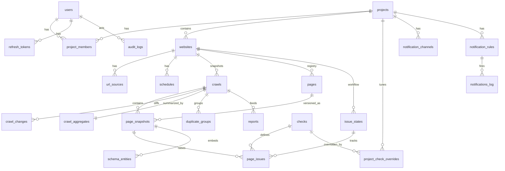

# 03 — Database Design (PostgreSQL)

## 1. Modeling principles

- **Immutable snapshot tables** (`page_snapshots`, `page_issues`, `schema_entities`, `crawl_changes`) are append-only and **range-partitioned by month** on `created_at`. High-churn crawl data never bloats hot tables; retention = partition drop.
- **Stable identity vs snapshot data:** `pages` is the durable per-website URL registry; snapshot tables reference both the crawl and the page. Issue _workflow_ state (assignee, status, tags) lives on a stable `issue_states` row keyed by fingerprint, so a "fixed" marking survives across crawls, while each crawl's `page_issues` rows stay immutable.
- **Extracted artifacts as JSONB, evidence-first:** each snapshot stores the parsed artifact object (meta, headings, link summary, hashes). Raw HTML lives in object storage, referenced by `content_hash`.
- **Everything a check needs to re-judge is persisted** — crawls can be re-validated after rule-pack updates without refetching.

## 2. ER diagram



## 3. DDL

```sql
-- ========== identity & access ==========
CREATE TABLE users (
  id            uuid PRIMARY KEY DEFAULT gen_random_uuid(),
  email         citext UNIQUE NOT NULL,
  password_hash text NOT NULL,                          -- argon2id
  name          text NOT NULL,
  is_super_admin boolean NOT NULL DEFAULT false,
  is_active     boolean NOT NULL DEFAULT true,
  created_at    timestamptz NOT NULL DEFAULT now(),
  updated_at    timestamptz NOT NULL DEFAULT now()
);

CREATE TABLE refresh_tokens (
  id          uuid PRIMARY KEY DEFAULT gen_random_uuid(),
  user_id     uuid NOT NULL REFERENCES users(id) ON DELETE CASCADE,
  token_hash  text NOT NULL,
  expires_at  timestamptz NOT NULL,
  revoked_at  timestamptz,
  created_at  timestamptz NOT NULL DEFAULT now()
);

CREATE TYPE project_role AS ENUM ('admin','seo_manager','developer','viewer');

CREATE TABLE projects (
  id         uuid PRIMARY KEY DEFAULT gen_random_uuid(),
  name       text NOT NULL,
  slug       citext UNIQUE NOT NULL,
  settings   jsonb NOT NULL DEFAULT '{}',   -- render policy, politeness, dup thresholds, retention overrides
  created_by uuid REFERENCES users(id),
  created_at timestamptz NOT NULL DEFAULT now(),
  updated_at timestamptz NOT NULL DEFAULT now()
);

CREATE TABLE project_members (
  project_id uuid NOT NULL REFERENCES projects(id) ON DELETE CASCADE,
  user_id    uuid NOT NULL REFERENCES users(id) ON DELETE CASCADE,
  role       project_role NOT NULL,
  created_at timestamptz NOT NULL DEFAULT now(),
  PRIMARY KEY (project_id, user_id)
);

-- ========== websites, sources, schedules ==========
CREATE TABLE websites (
  id          uuid PRIMARY KEY DEFAULT gen_random_uuid(),
  project_id  uuid NOT NULL REFERENCES projects(id) ON DELETE CASCADE,
  name        text NOT NULL,
  origin      text NOT NULL,                 -- https://www.cardekho.com
  path_scope  text NOT NULL DEFAULT '/',
  settings    jsonb NOT NULL DEFAULT '{}',   -- UA, auth headers ref, render policy override, robots override
  is_active   boolean NOT NULL DEFAULT true,
  created_at  timestamptz NOT NULL DEFAULT now(),
  updated_at  timestamptz NOT NULL DEFAULT now(),
  UNIQUE (project_id, origin, path_scope)
);

CREATE TYPE url_source_type AS ENUM ('manual','csv','sitemap','discovery');

CREATE TABLE url_sources (
  id          uuid PRIMARY KEY DEFAULT gen_random_uuid(),
  website_id  uuid NOT NULL REFERENCES websites(id) ON DELETE CASCADE,
  type        url_source_type NOT NULL,
  config      jsonb NOT NULL,     -- sitemap url | csv object key + column map | url list ref | seed+depth+max
  is_active   boolean NOT NULL DEFAULT true,
  created_at  timestamptz NOT NULL DEFAULT now()
);

CREATE TABLE schedules (
  id          uuid PRIMARY KEY DEFAULT gen_random_uuid(),
  website_id  uuid NOT NULL REFERENCES websites(id) ON DELETE CASCADE,
  cron        text NOT NULL,                 -- '0 3 * * *'; presets map to cron
  timezone    text NOT NULL DEFAULT 'Asia/Kolkata',
  mode        text NOT NULL DEFAULT 'incremental' CHECK (mode IN ('full','incremental')),
  is_active   boolean NOT NULL DEFAULT true,
  next_run_at timestamptz,
  created_at  timestamptz NOT NULL DEFAULT now()
);

-- ========== crawls & pages ==========
CREATE TYPE crawl_status AS ENUM
  ('queued','resolving','running','paused','finalizing','completed','failed','cancelled');
CREATE TYPE crawl_trigger AS ENUM ('manual','scheduled','api');

CREATE TABLE crawls (
  id             uuid PRIMARY KEY DEFAULT gen_random_uuid(),
  website_id     uuid NOT NULL REFERENCES websites(id) ON DELETE CASCADE,
  status         crawl_status NOT NULL DEFAULT 'queued',
  trigger        crawl_trigger NOT NULL,
  mode           text NOT NULL CHECK (mode IN ('full','incremental')),
  rule_pack_version text NOT NULL,           -- vocabulary+profile pack that judged this crawl
  stats          jsonb NOT NULL DEFAULT '{}',-- {total, crawled, unchanged, failed, pending}
  started_at     timestamptz,
  finished_at    timestamptz,
  created_by     uuid REFERENCES users(id),
  created_at     timestamptz NOT NULL DEFAULT now()
);
CREATE INDEX idx_crawls_site_time ON crawls (website_id, created_at DESC);

CREATE TABLE pages (                          -- durable URL registry per website
  id            uuid PRIMARY KEY DEFAULT gen_random_uuid(),
  website_id    uuid NOT NULL REFERENCES websites(id) ON DELETE CASCADE,
  url           text NOT NULL,
  url_hash      bytea NOT NULL,               -- sha256(normalized url)
  first_seen_at timestamptz NOT NULL DEFAULT now(),
  last_seen_at  timestamptz NOT NULL DEFAULT now(),
  is_deleted    boolean NOT NULL DEFAULT false,
  UNIQUE (website_id, url_hash)
);
CREATE INDEX idx_pages_site_url ON pages (website_id, url text_pattern_ops); -- directory-prefix filters

-- ========== snapshot tables (monthly partitions) ==========
CREATE TABLE page_snapshots (
  id             uuid NOT NULL DEFAULT gen_random_uuid(),
  crawl_id       uuid NOT NULL,
  page_id        uuid NOT NULL,
  website_id     uuid NOT NULL,
  fetch_status   text NOT NULL CHECK (fetch_status IN ('ok','unchanged','redirected','error','carried_forward')),
  http_status    int,
  redirect_chain jsonb,
  content_hash   bytea,                       -- key into object storage
  artifacts      jsonb,                       -- parsed meta/headings/images/link summary/hashes
  score          numeric(5,2),
  issue_counts   jsonb NOT NULL DEFAULT '{}', -- {critical:0,high:0,...}
  timing_ms      jsonb,
  rendered       boolean NOT NULL DEFAULT false,
  created_at     timestamptz NOT NULL DEFAULT now(),
  PRIMARY KEY (id, created_at)
) PARTITION BY RANGE (created_at);
CREATE INDEX idx_snap_crawl ON page_snapshots (crawl_id, page_id);
CREATE INDEX idx_snap_page_time ON page_snapshots (page_id, created_at DESC);

CREATE TYPE issue_severity AS ENUM ('critical','high','medium','low','info');

CREATE TABLE page_issues (
  id            uuid NOT NULL DEFAULT gen_random_uuid(),
  crawl_id      uuid NOT NULL,
  snapshot_id   uuid NOT NULL,
  page_id       uuid NOT NULL,
  website_id    uuid NOT NULL,
  check_id      text NOT NULL,                -- FK-by-convention into checks catalog
  severity      issue_severity NOT NULL,      -- effective severity after project overrides
  fingerprint   bytea NOT NULL,               -- sha256(website|page|check|evidence-key) → issue_states
  evidence      jsonb NOT NULL,               -- extracted values, selector, expected vs actual
  created_at    timestamptz NOT NULL DEFAULT now(),
  PRIMARY KEY (id, created_at)
) PARTITION BY RANGE (created_at);
CREATE INDEX idx_issues_crawl_sev ON page_issues (crawl_id, severity, check_id);
CREATE INDEX idx_issues_fp ON page_issues (fingerprint, created_at DESC);

CREATE TABLE schema_entities (
  id             uuid NOT NULL DEFAULT gen_random_uuid(),
  crawl_id       uuid NOT NULL,
  snapshot_id    uuid NOT NULL,
  page_id        uuid NOT NULL,
  website_id     uuid NOT NULL,
  format         text NOT NULL CHECK (format IN ('json-ld','microdata','rdfa')),
  schema_type    text NOT NULL,               -- 'Article', 'Product', ...
  status         text NOT NULL CHECK (status IN ('valid','warnings','errors','invalid_json')),
  properties     jsonb NOT NULL,              -- normalized entity
  validation     jsonb NOT NULL,              -- missing/invalid/deprecated props, messages
  rich_results   jsonb,                       -- [{profile:'Article', eligible:true, reasons:[...]}]
  entity_hash    bytea NOT NULL,              -- for cross-crawl schema diffing
  confidence     numeric(4,3),
  created_at     timestamptz NOT NULL DEFAULT now(),
  PRIMARY KEY (id, created_at)
) PARTITION BY RANGE (created_at);
CREATE INDEX idx_schema_crawl_type ON schema_entities (crawl_id, schema_type, status);

CREATE TABLE crawl_changes (                  -- computed diff vs previous crawl
  id            uuid NOT NULL DEFAULT gen_random_uuid(),
  crawl_id      uuid NOT NULL,
  website_id    uuid NOT NULL,
  page_id       uuid,
  change_type   text NOT NULL,  -- page_added|page_removed|page_redirected|title_changed|meta_desc_changed|
                                -- canonical_changed|robots_changed|schema_added|schema_removed|schema_modified|
                                -- issue_introduced|issue_resolved|link_broken|link_fixed|noindex_added|...
  severity      issue_severity NOT NULL,
  before        jsonb,
  after         jsonb,
  created_at    timestamptz NOT NULL DEFAULT now(),
  PRIMARY KEY (id, created_at)
) PARTITION BY RANGE (created_at);
CREATE INDEX idx_changes_crawl ON crawl_changes (crawl_id, change_type, severity);

-- ========== check catalog & overrides ==========
CREATE TABLE checks (                         -- seeded from packages/seo-engine registry on deploy
  id              text PRIMARY KEY,           -- 'meta.title.missing'
  category        text NOT NULL,              -- meta|headings|images|links|technical|schema|duplicate
  default_severity issue_severity NOT NULL,
  default_weight  numeric(5,2) NOT NULL,
  title           text NOT NULL,
  description     text NOT NULL,
  seo_impact      text NOT NULL,
  business_impact text NOT NULL,
  suggested_fix   text NOT NULL,
  doc_url         text,
  is_active       boolean NOT NULL DEFAULT true
);

CREATE TABLE project_check_overrides (
  project_id uuid NOT NULL REFERENCES projects(id) ON DELETE CASCADE,
  check_id   text NOT NULL REFERENCES checks(id),
  severity   issue_severity,
  weight     numeric(5,2),
  is_enabled boolean NOT NULL DEFAULT true,
  PRIMARY KEY (project_id, check_id)
);

-- ========== issue workflow (stable across crawls) ==========
CREATE TYPE issue_workflow_status AS ENUM ('open','acknowledged','in_progress','fixed','ignored','regressed');

CREATE TABLE issue_states (
  fingerprint   bytea PRIMARY KEY,
  website_id    uuid NOT NULL REFERENCES websites(id) ON DELETE CASCADE,
  check_id      text NOT NULL,
  status        issue_workflow_status NOT NULL DEFAULT 'open',
  assignee_id   uuid REFERENCES users(id),
  tags          text[] NOT NULL DEFAULT '{}',
  first_seen_crawl_id uuid NOT NULL,
  last_seen_crawl_id  uuid NOT NULL,
  resolved_crawl_id   uuid,
  updated_by    uuid REFERENCES users(id),
  updated_at    timestamptz NOT NULL DEFAULT now()
);
CREATE INDEX idx_states_site_status ON issue_states (website_id, status, check_id);

-- ========== aggregates & trends (dashboards read only these) ==========
CREATE TABLE crawl_aggregates (
  crawl_id      uuid PRIMARY KEY,
  website_id    uuid NOT NULL,
  seo_score     numeric(5,2) NOT NULL,
  metrics       jsonb NOT NULL,   -- every dashboard counter: pages_*, issues by severity/category,
                                  -- schema_coverage, rich_result_coverage, duplicates, noindex, broken, ...
  created_at    timestamptz NOT NULL DEFAULT now()
);

CREATE TABLE trend_daily (        -- one row per website per day (last crawl of day wins)
  website_id  uuid NOT NULL,
  day         date NOT NULL,
  crawl_id    uuid NOT NULL,
  seo_score   numeric(5,2) NOT NULL,
  metrics     jsonb NOT NULL,
  PRIMARY KEY (website_id, day)
);

CREATE TABLE duplicate_groups (
  id          uuid PRIMARY KEY DEFAULT gen_random_uuid(),
  crawl_id    uuid NOT NULL,
  website_id  uuid NOT NULL,
  field       text NOT NULL,      -- title|meta_description|h1|canonical|og|twitter|schema|body
  value_hash  bytea NOT NULL,
  sample      text,
  page_ids    uuid[] NOT NULL,
  page_count  int NOT NULL
);
CREATE INDEX idx_dups_crawl ON duplicate_groups (crawl_id, field);

-- ========== reports, notifications, AI, audit ==========
CREATE TABLE reports (
  id          uuid PRIMARY KEY DEFAULT gen_random_uuid(),
  project_id  uuid NOT NULL REFERENCES projects(id) ON DELETE CASCADE,
  website_id  uuid,
  type        text NOT NULL,      -- executive|seo_team|developer|schema|daily|weekly|monthly|comparison|regression|trend
  format      text NOT NULL,      -- pdf|xlsx|csv|json|html
  params      jsonb NOT NULL,     -- crawl ids, date range, filters
  status      text NOT NULL DEFAULT 'queued' CHECK (status IN ('queued','running','completed','failed')),
  object_key  text,               -- download location in object storage
  created_by  uuid REFERENCES users(id),
  created_at  timestamptz NOT NULL DEFAULT now(),
  completed_at timestamptz
);

CREATE TABLE notification_channels (
  id          uuid PRIMARY KEY DEFAULT gen_random_uuid(),
  project_id  uuid NOT NULL REFERENCES projects(id) ON DELETE CASCADE,
  type        text NOT NULL CHECK (type IN ('email','slack','teams','webhook')),
  config      jsonb NOT NULL,     -- recipients | webhook url + secret ref
  is_active   boolean NOT NULL DEFAULT true
);

CREATE TABLE notification_rules (
  id          uuid PRIMARY KEY DEFAULT gen_random_uuid(),
  project_id  uuid NOT NULL REFERENCES projects(id) ON DELETE CASCADE,
  event       text NOT NULL,      -- score_drop|schema_failure|canonical_missing|noindex_detected|sitemap_broken|
                                  -- robots_changed|broken_link_spike|crawl_completed|crawl_failed
  condition   jsonb NOT NULL DEFAULT '{}',   -- thresholds
  channel_ids uuid[] NOT NULL,
  throttle_minutes int NOT NULL DEFAULT 60,
  is_active   boolean NOT NULL DEFAULT true
);

CREATE TABLE notifications_log (
  id          uuid PRIMARY KEY DEFAULT gen_random_uuid(),
  rule_id     uuid REFERENCES notification_rules(id) ON DELETE SET NULL,
  crawl_id    uuid,
  payload     jsonb NOT NULL,
  status      text NOT NULL,      -- sent|failed|throttled
  created_at  timestamptz NOT NULL DEFAULT now()
);

CREATE TABLE ai_explanations (
  id            uuid PRIMARY KEY DEFAULT gen_random_uuid(),
  check_id      text NOT NULL,
  evidence_hash bytea NOT NULL,
  content       jsonb NOT NULL,   -- human/dev explanations, fix example, effort, priority
  model         text NOT NULL,
  created_at    timestamptz NOT NULL DEFAULT now(),
  UNIQUE (check_id, evidence_hash)
);

CREATE TABLE audit_logs (
  id          bigint GENERATED ALWAYS AS IDENTITY PRIMARY KEY,
  user_id     uuid,
  project_id  uuid,
  action      text NOT NULL,      -- 'crawl.start', 'settings.update', ...
  entity      text,
  entity_id   text,
  before      jsonb,
  after       jsonb,
  ip          inet,
  created_at  timestamptz NOT NULL DEFAULT now()
);
CREATE INDEX idx_audit_proj_time ON audit_logs (project_id, created_at DESC);

CREATE TABLE settings (           -- global key-value (rule-pack active version, feature flags)
  key        text PRIMARY KEY,
  value      jsonb NOT NULL,
  updated_at timestamptz NOT NULL DEFAULT now()
);
```

## 4. Partitioning, indexing, retention

- **Partitions:** `page_snapshots`, `page_issues`, `schema_entities`, `crawl_changes` are `PARTITION BY RANGE (created_at)`, one partition per month, created 2 months ahead by a maintenance job. All queries carry a crawl id or date range → partition pruning applies.
- **Why time not crawl-hash:** trend and "history of this page" queries span crawls; monthly ranges serve both per-crawl (crawl dates fall in 1–2 partitions) and time-series access, and retention becomes `DROP PARTITION`.
- **Write path:** per-page transaction inserts snapshot + issues + entities via multi-row inserts; the finalizer uses set-based SQL (no row-at-a-time diffing in JS for counts).
- **Cross-crawl diffs** join `page_snapshots` of crawl N and N-1 on `page_id` — both indexed `(crawl_id, page_id)`.
- **Retention (defaults, per-project overridable):** raw HTML objects 30 days (lifecycle rule on the bucket); snapshot/issue/entity partitions 13 months; `crawl_aggregates`, `trend_daily`, `crawls`, `issue_states` forever.
- **FKs on partitioned tables:** snapshot tables intentionally omit FK constraints to `crawls`/`pages` (write throughput; integrity enforced at the application boundary and by nightly reconciliation checks).
