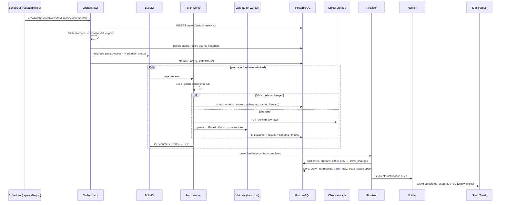
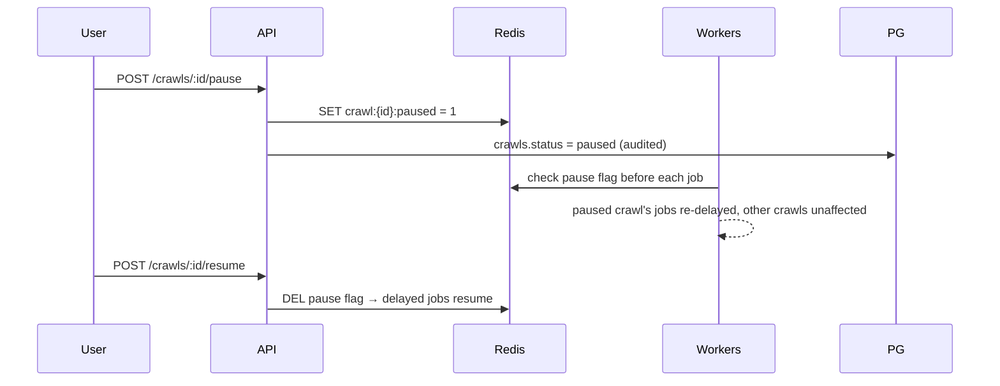

# 05 — Crawling Pipeline

## 1. Queue topology (BullMQ on Redis)

| Queue               | Job                                           | Concurrency model                             | Priority                |
| ------------------- | --------------------------------------------- | --------------------------------------------- | ----------------------- |
| `crawl-orchestrate` | resolve URL set, create crawl, fan out        | low global concurrency                        | manual > scheduled      |
| `page-fetch`        | conditional GET + parse + validate + persist  | high; **per-domain group limiter**            | inherits crawl priority |
| `page-render`       | Playwright render for JS-required pages       | low; memory-bounded pool, separate deployment | inherits                |
| `link-check`        | HEAD/GET unique outbound targets              | medium; per-target-host limiter               | low                     |
| `crawl-finalize`    | cross-page checks, diff, score, aggregates    | one per crawl                                 | high                    |
| `report-generate`   | build PDF/xlsx/csv/json/html                  | low                                           | low                     |
| `notify`            | evaluate rules, dispatch channels             | medium                                        | high                    |
| `ai-explain`        | Claude API calls, cached                      | low + provider rate limit                     | low                     |
| `maintenance`       | partition creation, retention, sitemap health | repeatable                                    | low                     |

**Politeness:** BullMQ group keys = registrable domain. Each group has `maxConcurrency` (default 4) and a Redis token-bucket rate limit (default 5 req/s, per-website configurable). Adding workers increases _aggregate_ throughput across domains but never the per-domain rate (NFR-REL-2: one slow site can't starve others — its group simply stays saturated while other groups proceed).

**Scheduling:** each active `schedules` row maps to a BullMQ repeatable job (cron + timezone). A reconciler job re-syncs repeatables from the DB on deploy and hourly (fixes drift after edits). `next_run_at` is written back for dashboard display. Overlap guard: if the previous scheduled crawl for a website is still running, the new one is skipped and logged (configurable: skip | queue-behind).

## 2. Crawl state machine

```
queued → resolving → running ⇄ paused
                     running → finalizing → completed
any-active-state → cancelled
resolving|running|finalizing → failed (only on unrecoverable orchestration errors;
                                       individual page failures never fail a crawl)
```

Controls map to queue primitives: **pause** = pause the crawl's jobs (group-level flag checked by workers before processing), **resume** = unpause, **cancel** = mark crawl cancelled + drain its pending jobs, **retry-failed** = re-enqueue `page-fetch` for snapshots with `fetch_status='error'` into the same crawl.

Progress counters (`total, crawled, unchanged, failed, pending`) are Redis hashes incremented atomically by workers, streamed to the UI via SSE, and flushed to `crawls.stats` every 5s and on finalize. Finalize triggers when `crawled + unchanged + failed == total` (checked on every counter update; a watchdog in `maintenance` catches stuck crawls).

## 3. URL resolution & incremental logic

**Resolution (orchestrator):**

1. Gather URLs from all active sources: sitemaps (fetch, recurse index files, gunzip; record per-entry `lastmod`), CSV/manual lists, and — for discovery sources — seeds.
2. Normalize (lowercase scheme/host, strip fragments, resolve dot-segments, apply project query-param and trailing-slash policy) and dedupe; upsert into `pages` (updates `last_seen_at`).
3. Scope filter: same registrable domain + `path_scope` prefix; robots.txt rules applied (fetched fresh per crawl, snapshot stored — enables the `robots_changed` alert).
4. Sitemap diff vs previous crawl's URL set → `new sitemap entries` and candidates for `page_removed`.

**Incremental mode decision per page:**

```
if sitemap lastmod ≤ previous crawl date AND source is sitemap-with-lastmod:
    candidate for skip → verify cheaply with conditional GET anyway (lastmod lies)
send GET with If-None-Match / If-Modified-Since from previous snapshot
304 → fetch_status='unchanged'; carry forward previous snapshot's artifacts/issues
      (new snapshot row, carried_forward=true, same content_hash)
200 → sha256(body); if hash == previous hash → treat as unchanged
      else → full parse + validate (changed page)
```

Full mode skips carry-forward and re-validates everything (used after rule-pack updates or on demand). Deleted-page detection: URLs present in crawl N-1 but absent from crawl N's resolved set are probed once; 404/410 → `page_removed` change + `pages.is_deleted`; 3xx → `page_redirected`.

**Discovery crawling:** fetch workers extract in-scope internal links from each processed page; unseen URLs (Redis set per crawl) are enqueued into the same crawl until `maxDepth`/`maxPages`. Orphan detection at finalize: pages reachable from no internal link but present in sitemap.

## 4. Fetch & render strategy

```
page-fetch worker:
  SSRF guard (resolve DNS → reject private/link-local ranges; re-check every redirect hop)
  GET with UA + optional site auth headers; follow ≤ 5 redirects, recording the chain
  store raw body → object storage (key = sha256(body)), content-encoding preserved
  render decision:
    website.renderPolicy == 'never'  → parse static HTML
    website.renderPolicy == 'always' → enqueue page-render
    'auto' → parse static HTML; if signals fire (empty <h1>+<main>, root div with no text,
             <noscript> SPA markers, JSON-LD present only in framework hydration payload)
             → enqueue page-render, else proceed
  parse (Cheerio) → PageArtifacts → seo-engine + schema-engine → persist (one tx)

page-render worker:
  shared Chromium, context-per-job, contexts recycled every 50 pages
  block images/fonts/media (SEO needs DOM, not pixels); wait: networkidle ∧ selector heuristics; 30s cap
  serialized post-JS DOM → same parse/validate/persist path (rendered=true)
```

Failure handling: 3 attempts with exponential backoff + jitter for network errors and 429/503 (per-attempt UA note honored via `Retry-After`); HTTP 4xx/5xx after retries is **not a job failure** — it's a recorded result (`fetch_status='error'`, `http_status`) that feeds broken-page checks. Job-level crashes go to the DLQ with full context for the ops dashboard.

## 5. Link checking

Finalize-adjacent, not per-page: all outbound link targets from the crawl are deduped (a footer link on 1M pages = 1 check), enqueued to `link-check` with per-target-host politeness, results cached in Redis for the crawl window and persisted; broken targets fan back into `page_issues` for every page referencing them (set-based SQL join on the extracted-links artifact). Redirect chains > 2 hops and internal 3xx links are flagged.

## 6. Sequence diagrams

**Scheduled incremental crawl (happy path):**



**Pause / resume:**



## 7. Failure recovery matrix

| Failure                          | Behavior                                                                                                                        |
| -------------------------------- | ------------------------------------------------------------------------------------------------------------------------------- |
| Worker process crash             | BullMQ stalled-job detection re-queues in-flight jobs (at-least-once); persistence is idempotent per (crawl_id, page_id) upsert |
| Redis restart                    | Queues persist (AOF); workers reconnect; counters rebuilt from PG on mismatch                                                   |
| PG failover                      | Workers retry with backoff; jobs stay queued; no data loss (tx boundaries)                                                      |
| Render worker OOM                | Pod restart; job retried; page falls back to static parse after 2 render failures (flagged `renderFailed`)                      |
| Site blocks us (403/429 wave)    | Circuit breaker per domain: trip after threshold → pause group 15 min → alert ops; crawl continues elsewhere                    |
| Sitemap unreachable              | Crawl proceeds from registry + other sources; `sitemap_broken` notification fires                                               |
| Stuck crawl (no progress 30 min) | Watchdog marks failed-finalizable → finalize with partial data, alert                                                           |
