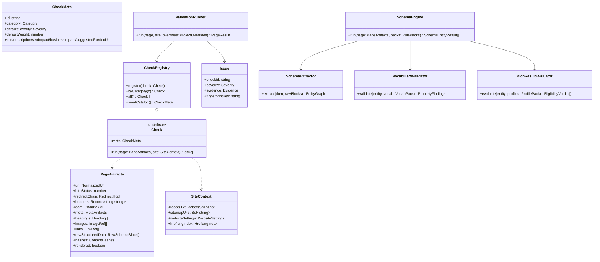

# 06 — Validation Engines

Two pure packages with zero I/O: `packages/seo-engine` (Technical SEO checks) and `packages/schema-engine` (structured data). Both consume the same input value object and emit `Issue[]` / `SchemaEntityResult[]`.

## 1. Core contracts & class diagram



- Each check is a small class/closure implementing `Check` — Open/Closed: new checks are new registrations, never edits to the runner.
- `ValidationRunner` applies project overrides (severity/weight/disabled) _after_ checks run, so engine output is project-independent and cacheable.
- `fingerprintKey` is the stable evidence key (e.g. the duplicate value hash, the missing property name) that makes issue workflow survive across crawls.
- Cross-page checks (duplicates, orphans, sitemap reconciliation, hreflang reciprocity) implement a separate `CrawlCheck` interface run by the finalizer over set-based SQL results, not per-page.

## 2. Technical SEO check catalog

IDs are `category.subject.condition`. Severities are defaults (project-overridable). This catalog seeds the `checks` table; full remediation copy lives with each check's registration.

### meta.*

| Check                                                                                                               | Sev                   |
| ------------------------------------------------------------------------------------------------------------------- | --------------------- |
| `meta.title.missing` / `.empty` / `.too_long` (>60ch) / `.too_short` (<10ch) / `.duplicate_on_site`*                | C / C / M / L / H     |
| `meta.description.missing` / `.too_long` (>160) / `.too_short` / `.duplicate_on_site`*                              | H / L / L / M         |
| `meta.canonical.missing` / `.multiple` / `.cross_domain` / `.non_https` / `.points_to_error`* / `.mismatch_with_og` | H / C / M / M / C / M |
| `meta.robots.noindex` / `.nofollow` / `.conflicting_directives` / `.header_html_conflict` (X-Robots-Tag vs meta)    | C / H / H / H         |
| `meta.charset.missing` / `.not_utf8`                                                                                | M / L                 |
| `meta.viewport.missing` / `.not_responsive`                                                                         | H / M                 |
| `meta.lang.missing` / `.invalid_bcp47` / `.mismatch_content`†                                                       | M / M / L             |
| `meta.theme_color.missing`                                                                                          | Info                  |
| `meta.hreflang.invalid_code` / `.missing_self_ref` / `.no_reciprocal`* / `.points_to_noindex`*                      | H / M / H / H         |
| `meta.og.missing_required` (title/type/image/url) / `.image_broken`* / `.duplicate_on_site`*                        | M / M / L             |
| `meta.twitter.missing_card` / `.incomplete`                                                                         | L / L                 |
| `meta.favicon.missing` / `.broken`*                                                                                 | L / L                 |
| `meta.manifest.missing` / `.invalid_json`*                                                                          | Info / L              |

### headings.*

`h1.missing` (H) · `h1.multiple` (M) · `h1.duplicate_of_title` (Info) · `h1.duplicate_on_site`* (M) · `hierarchy.skipped_level` (L) · `any.empty` (M) · `any.duplicate_within_page` (L)

### images.*

`alt.missing` (H) · `alt.empty_on_meaningful` (M) · `alt.duplicate_within_page` (L) · `src.broken`* (H) · `dimensions.missing_width`/`missing_height` (L) · `loading.no_lazy_below_fold` (Info) · `mime.unsupported_format` (L)

### links.*

`internal.broken`* (C) · `external.broken`* (M) · `internal.redirects` (M) · `redirect.chain_too_long`* (H) · `rel.noopener_missing_on_blank` (L) · `rel.sponsored_missing_paid`† (Info) · `rel.ugc_missing`† (Info) · `anchor.empty_or_generic` ("click here") (L) · `internal.nofollow` (M) · `page.orphan`* (H) · `internal.too_many` (>1000) (L)

### technical.*

`https.not_secure` (C) · `https.mixed_content` (H) · `status.4xx`/`5xx` (C) · `status.redirect_in_sitemap`* (M) · `redirect.http_to_https_chain` (L) · `robots_txt.blocks_page`* (H) · `robots_txt.missing`* (M) · `sitemap.page_missing`* (M) · `sitemap.contains_noindex`* (H) · `pagination.rel_prev_next_broken` (L) · `canonical.duplicate_targets_on_site`* (H) · `resources.blocked_by_robots`* (M) · `url.too_long`/`.uppercase`/`.underscores`/`.excessive_params` (L) · `url.trailing_slash_inconsistent`* (L)

\* cross-page/finalizer or link-checker check · † heuristic, ships severity Info/Low with confidence noted in evidence

### duplicates.* (finalizer, from `duplicate_groups`)

`title` (H) · `meta_description` (M) · `h1` (M) · `canonical` (H) · `og` (L) · `twitter` (L) · `schema` (M) · `body_similarity` (H, SimHash 64-bit over shingled visible text; Hamming ≤ project threshold, default 3)

## 3. Schema.org engine

**Extraction** (`SchemaExtractor`):

- **JSON-LD:** every `<script type="application/ld+json">`; tolerant parse (recover from trailing commas/BOM where safely possible — recovery itself is a warning `schema.jsonld.malformed_but_parseable`; hard failures → `invalid_json` entity result with the raw block preserved). `@graph`, arrays, and `@id` references are resolved into a normalized entity graph.
- **Microdata:** `itemscope/itemtype/itemprop` walker → same graph model.
- **RDFa:** `vocab/typeof/property` subset (schema.org vocab) → same graph model.
- Cross-format duplicate entity detection (same type + same identifying props in JSON-LD _and_ Microdata) → warning.

**Vocabulary validation** (`VocabularyValidator`) — driven by the **vocab pack**: a versioned JSON snapshot generated from the official schema.org release (`schemaorg-current-https.jsonld`) at build time, checked into `packages/schema-engine/packs/vocab-vX.Y.json`:

- unknown type (with closest-match suggestion), unknown property for type (honoring inheritance up the type hierarchy), deprecated (superseded) types/properties, expected-type violations (e.g. `datePublished` not ISO-8601, `aggregateRating` not an `AggregateRating`), nested entity recursion, enumeration membership (e.g. `availability` ∈ ItemAvailability).
- Every official schema.org type is supported by construction — the pack contains the whole vocabulary; nothing is hardcoded per type.

**Rich-result eligibility** (`RichResultEvaluator`) — driven by the **profile pack**: versioned JSON encoding Google's documented requirements per rich-result profile (Article, Product, Review snippet, Breadcrumb, FAQ, Event, Video, JobPosting, Vehicle listing, Organization, LocalBusiness, HowTo…): required properties, recommended properties, value constraints (image aspect/size where stated, offer price format), and contextual conditions. Verdict per (entity, profile): `eligible | eligible_with_warnings | ineligible`, with machine-readable reasons ("missing required `author`", "`image` present but not URL-shaped").

**Confidence score** per entity: starts at 1.0, deducts for parse recovery, type inference (Microdata without full IRI), and heuristic property coercions — surfaced so users can distinguish "definitely broken" from "possibly our parser".

**Schema diffing** (finalizer): entities matched across crawls by (page, type, identity hint `@id`/`url`/`name`) then property sets compared → `schema_added` / `schema_removed` / `schema_modified` changes; property-level before/after recorded. Removal of a _required_ rich-result property is escalated to Critical (the "author removed from Article" case).

**Pack lifecycle:** packs are versioned, the active version is a `settings` row, every crawl records `rule_pack_version`, and a pack upgrade can trigger re-validation of the latest crawl from stored artifacts (no refetch).

## 4. Scoring algorithm

Per-page score:

```
pageScore = 100 − Σ over distinct failed checks( effectiveWeight(check) × severityMultiplier )
   severityMultiplier: critical 1.0 · high 0.6 · medium 0.3 · low 0.1 · info 0
   clamped to [0, 100]; repeated instances of one check on a page count once at full
   weight + log2(instanceCount) × 10% (a page with 200 missing alts is worse than one, but not 200×)
```

Site score = weighted mean of page scores (weight 1.0; sitemap-priority weighting is a future enhancement) with a **category floor rule**: any Critical issue on >10% of pages caps the site score at 79 ("B"). Category sub-scores (meta/headings/images/links/technical/schema) computed the same way for dashboard breakdowns. All weights/multipliers/thresholds live in config + project overrides; the algorithm version is recorded in `crawl_aggregates.metrics.scoringVersion` so historical scores remain interpretable.

## 5. Change detection

Finalizer diff of crawl N vs N−1 (set-based SQL over `page_snapshots` joined on `page_id`):

- page set: added / removed / redirected (from removal probes, §05)
- field-level: title, meta description, canonical, robots — compare artifact hashes then values
- schema: entity/property diff (§3)
- issues: `issue_introduced` (fingerprint in N not in N−1) / `issue_resolved` (in N−1 not in N; also flips `issue_states.status → fixed` unless user-set, and `fixed → regressed` on reappearance)
- links: broken introduced / fixed
  Everything lands in `crawl_changes` with severity, powering the compare view, regression report, and notifications.

## 6. AI explanation layer

Worker-side module, never in the request path for facts:

- Input: `CheckMeta` + concrete evidence JSON (engine-produced only). Prompt template forbids inventing measurements.
- Output JSON: `{humanExplanation, developerExplanation, seoImpact, businessImpact, fix: {summary, codeExample}, priority, estimatedEffort}` — validated with zod before storage.
- Cached in `ai_explanations` by `(check_id, sha256(canonical evidence))`; identical issues across millions of pages hit the cache.
- Crawl prioritization: top-K issue groups by (severity, page count, traffic-relevance hints) summarized into a ranked fix-first plan; stored per crawl.
